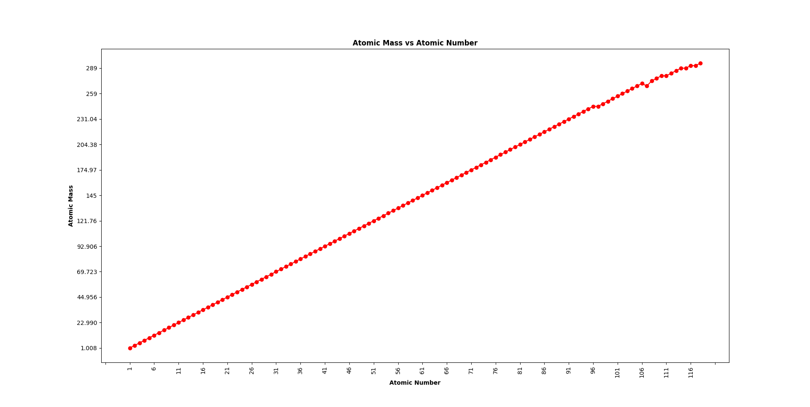

# Periodic Table Web Scraping Project

This repository contains a Python script and extracted data for scraping the periodic table from [www.periodni.com](https://www.periodni.com/periodic_table_of_the_elements.html). The project demonstrates how to extract structured chemical element data from a website, save it as an Excel file, and visualize it with a plot.

## Contents

- `periodic_table_scrap.py`: Python script that scrapes periodic table data and exports it to Excel.
- `periodic_table.xlsx`: Extracted periodic table data in Excel format (see citation below).
- `Plot.png`: Visualization of atomic mass vs. atomic number.

## Project Purpose

This project was created for educational purposes to practice and demonstrate web scraping skills using Python, BeautifulSoup, and data processing libraries. It is intended as a learning resource for those interested in web automation, data extraction, and scientific visualization.

## How It Works

1. The script downloads the periodic table page from www.periodni.com.
2. It parses the HTML to extract relevant chemical element data.
3. The data is saved into an Excel spreadsheet for easy access and analysis.
4. A plot is generated to visualize the relationship between atomic mass and atomic number.

## Requirements

- Python 3.x
- `requests`
- `beautifulsoup4`
- `pandas`
- (Optional) `openpyxl` for Excel export
- `matplotlib` for plotting

## Visualization

Below is the plot generated by the script, showing the relationship between atomic mass and atomic number:

## Data Source and Citation

The data in `periodic_table.xlsx` was scraped from [www.periodni.com](https://www.periodni.com/periodic_table_of_the_elements.html). 

(2025). Periodic table data extracted from www.periodni.com [periodic_table.xlsx]. Unpublished raw data.  
Data originally sourced from www.periodni.com.

## Disclaimer

- This project is for educational and demonstrative purposes only.
- Please review and respect the terms of service of www.periodni.com before using automated tools on their website.
- Do not use this code for large-scale or commercial scraping without permission from the data owner.

## Acknowledgments

- [www.periodni.com](http://www.periodni.com) for providing the periodic table data.
- Python open-source community for the libraries used in this project.

---
